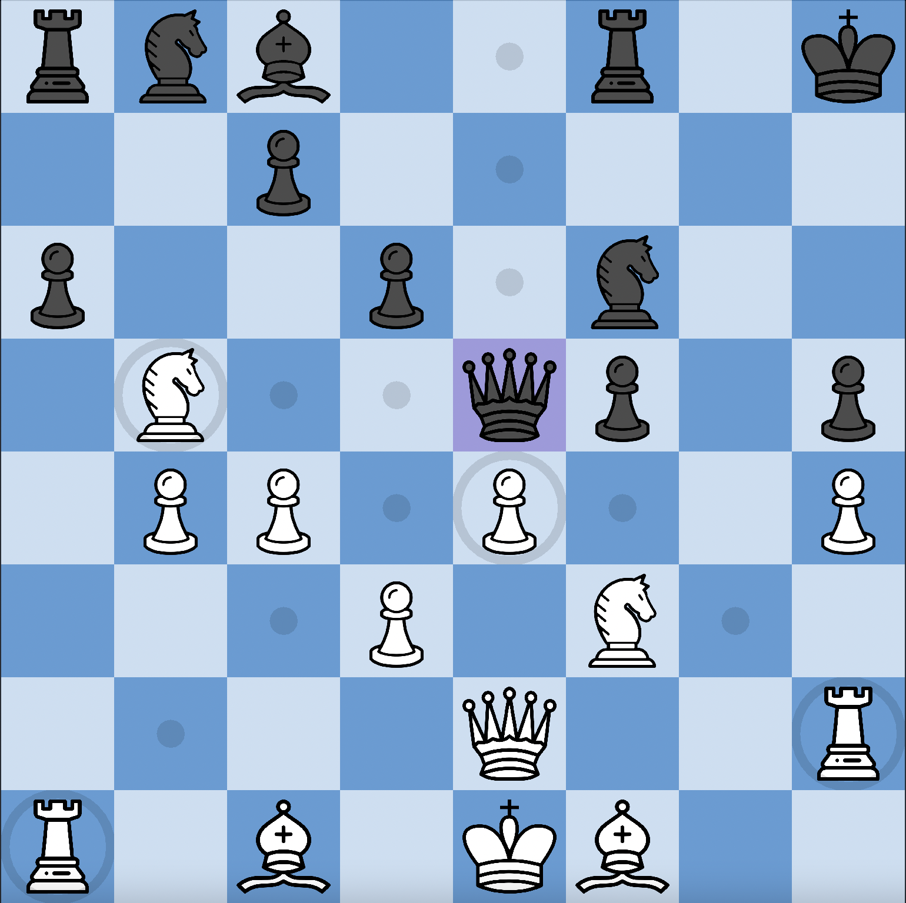

# Chess Reimagined

Experience the classic game of chess like never before with Chess Reimagined, a fully functional chess game built with Java Swing. Immerse yourself in the strategic world of chess, brought to life with intuitive controls, engaging visuals, and a comprehensive understanding of the game's rules.

## Features
* **Complete Rule Set**: Our game implements the full range of chess rules, including castling and pawn promotion.
* **Move Guidance**: Unsure of your next move? Our game highlights all available moves for each piece, ensuring you always have the information you need to make the best decisions.
* **Immersive Audio**: Enjoy an atmospheric soundtrack as you play, with the option to toggle music on or off as you wish.
* **Sleek Design**: Our clean and user-friendly interface, built using Java Swing, ensures seamless gameplay and effortless navigation.

